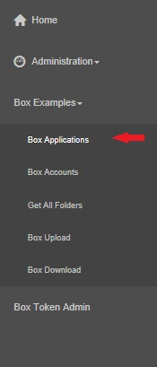
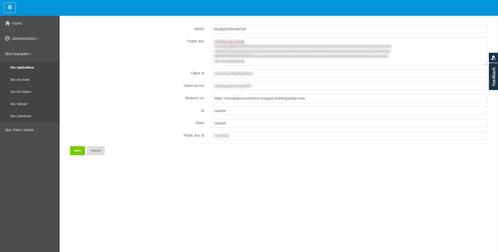
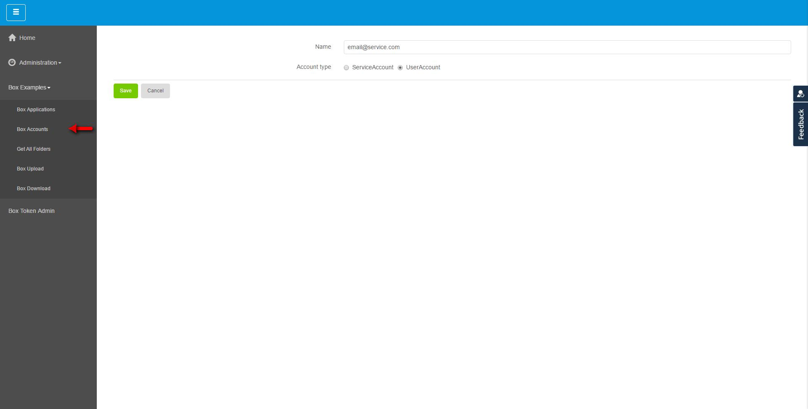
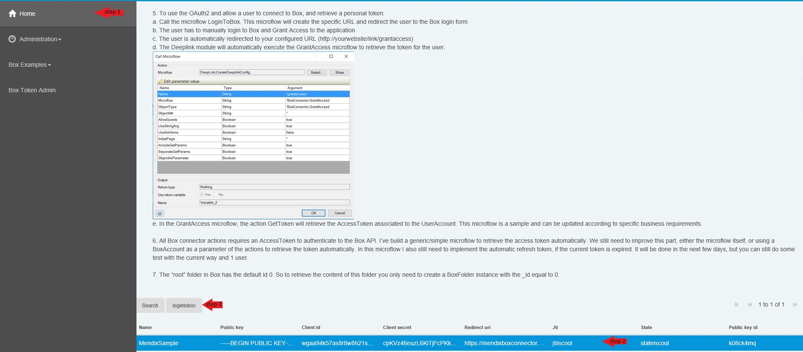
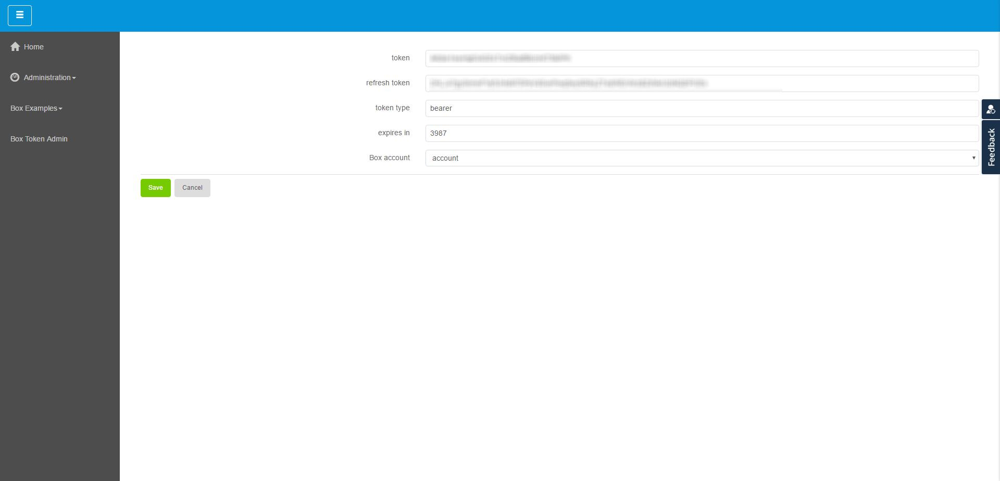

## Box configuration

In order to use the connectors it is required to have an acccount in the developer site of Box.com. In case you poses an account, please skip *Sign up*.

### Sign up

* Browse to [https://developer.box.com/](https://developer.box.com/)
* Click the **Sign up** button as indicated in the picture:


* Fill out the form with your credentials and submit:


* You will get a confirmation email to your address which contains a link that you must click on.
* Once your account has been validated, you will get access to the dashboard in your new Box account:


### Set up security
* In order to allow your connectors to have access to your account, you must enable the 2nd factor authentication as indicated below:


* To confirm the configuration, you will have to introduce the code from the text message you will get in the phone number you have provided.

### Create an application
* Now you will have to create a new application which your Mendix application will interact with. For that please navigate to [https://developer.box.com/](https://developer.box.com/).


* Already in your new created application, you need to set as redirect url the *domain address* of your Mendix application as ```https://<mendix_application_address>/link/grantaccess```, so Box is able to return to your application once it is authenticated.


* You will have to generate a RSA keypair. The following commands may change depending on your OS:

```

openssl genrsa -out boxmendixappdes.key 2048
openssl rsa -in boxmendixappdes.key -pubout > boxmendixappdes.pub

```
For more information regarding [Generating a RSA Keypair](https://docs.box.com/docs/app-auth#section-1-generating-an-rsa-keypair) please refer to Box documentation.

* Click the **add Public key** and then copy the content of ```boxmendixappdes.pub``` as indicated in the picture.


### Connect your newly built application to our connector

For being able to connect the application that you just made to the Mendix connector you need to follow the following simple steps.

* Open and run the Mendix connector.
* Navigate to Box application page using the Navigation bar on the left side of Mendix connector



* Press New and fill out the information according to your newly built box application.



* you also need to make an account to associate the final token to, in order to do that press box accounts on the navigation layout and press new to make a new account.



### Get a box token
This is the last required step. After configuring your Mendix connector the last step is to receive an authentication token to be able to have access to your box account. In order to receive the token you need to:

* Navigate to the home page of your Mendix connector, choose your Box application on the bottom of the page and press login.



* you will face a request from Box asking you to give permission to Mendix connector to have access to all files and folders of your account.

Once the access is given, you will be navigated back to your Mendix connector, where you find information regarding your token.
* Add your account to the Box account filed and press Save.



Congrats! You have successfully finished this tutorial and now are able to use different available features in this Connector to make your own personal app and control your box account.
