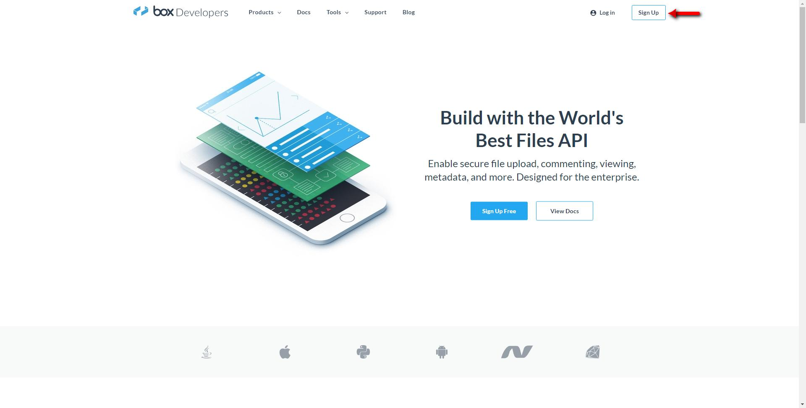
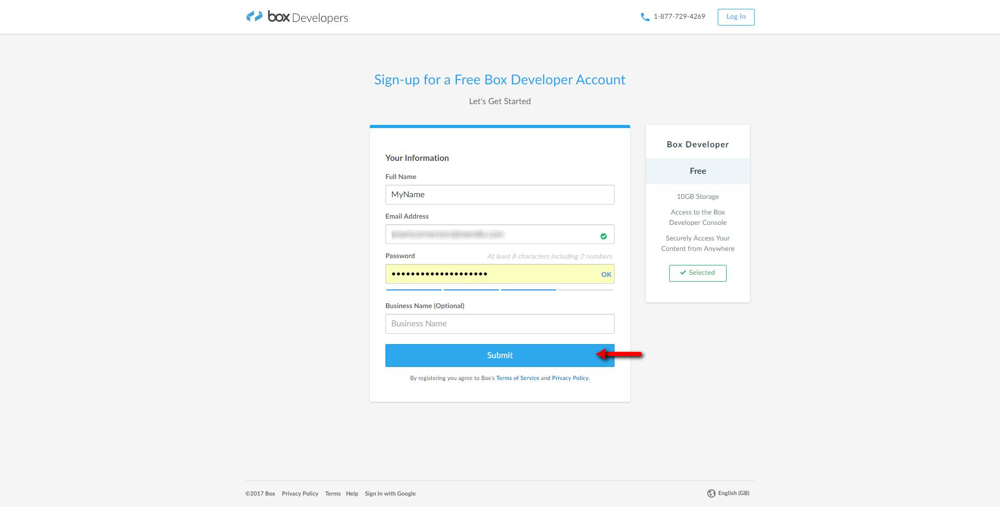
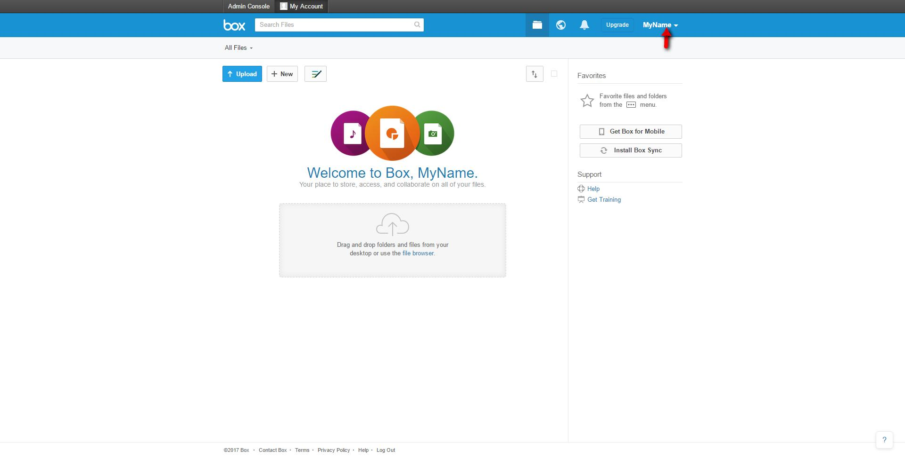
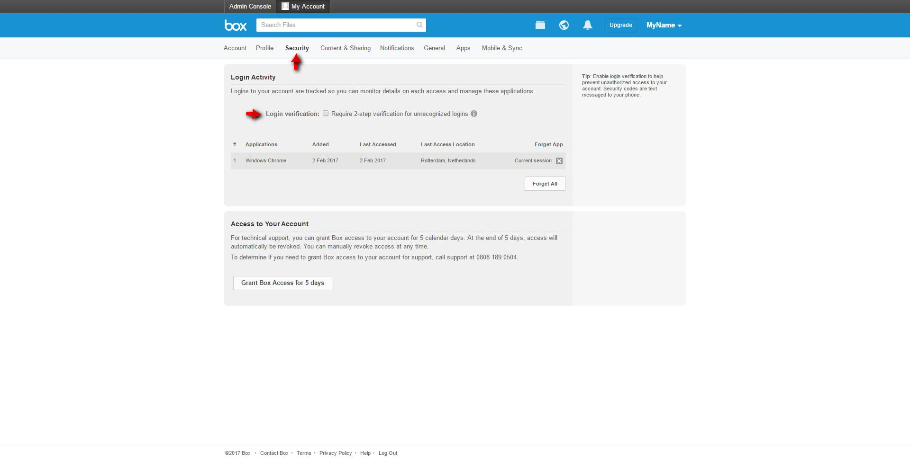
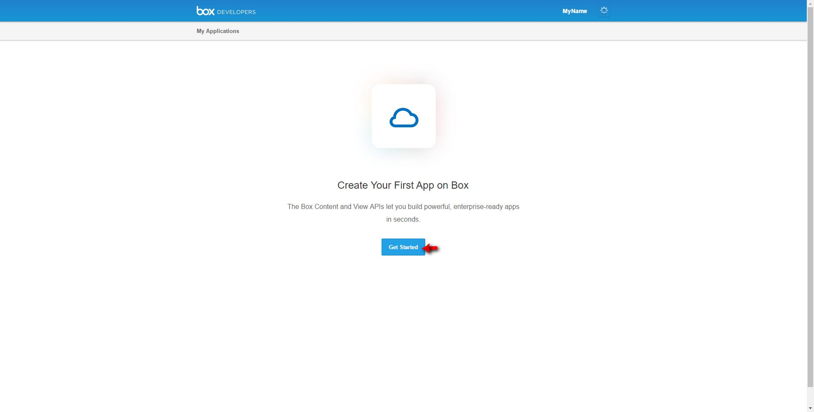
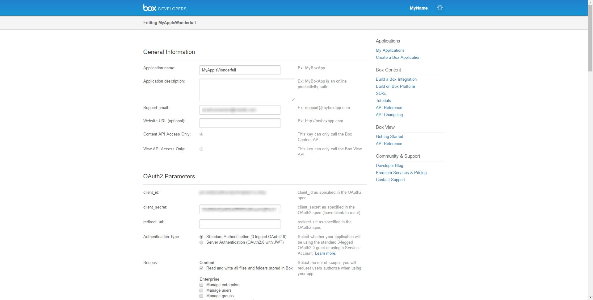
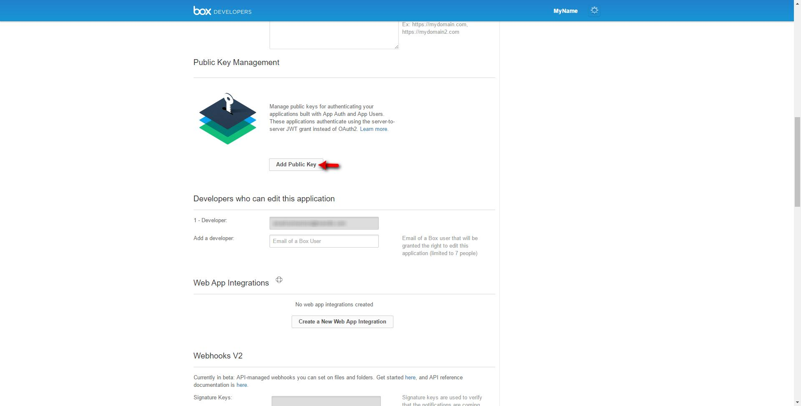

## Box configuration

In order to use the connectors it is required to have an acccount in the developer site of Box.com. In case you poses an account, please skip *Sign up*.

### Sign up

* Browse to [https://developer.box.com/](https://developer.box.com/)
* Click the **Sign up** button as indicated in the picture:



* Fill out the form with your credentials and submit:



* You will get a confirmation email to your address which contains a link that you must click on.
* Once your account has been validated, you will get access to the dashboard in your new Box account:



### Set up security
* In order to allow your connectors to have access to your account, you must enable the 2nd factor authentication as indicated below:



* To confirm the configuration, you will have to introduce the code from the text message you will get in the phone number you have provided.

### Create an application
* Now you will have to create a new application which your Mendix application will interact with:



* Already in your new created application, you need to set as redirect url the *domain address* of your Mendix application as ```https://<mendix_application_address>/link/grantaccess```, so Box is able to return to your application once it is authenticated.



1.You will to have generate a RSA keypair. The following commands may change depending on your OS:

```

openssl genrsa -out boxmendixappdes.key 2048
openssl rsa -in boxmendixappdes.key -pubout > boxmendixappdes.pub

```
* Click the **add Public key** and then copy the content of ```boxmendixappdes.pub``` as indicated in the picture.


